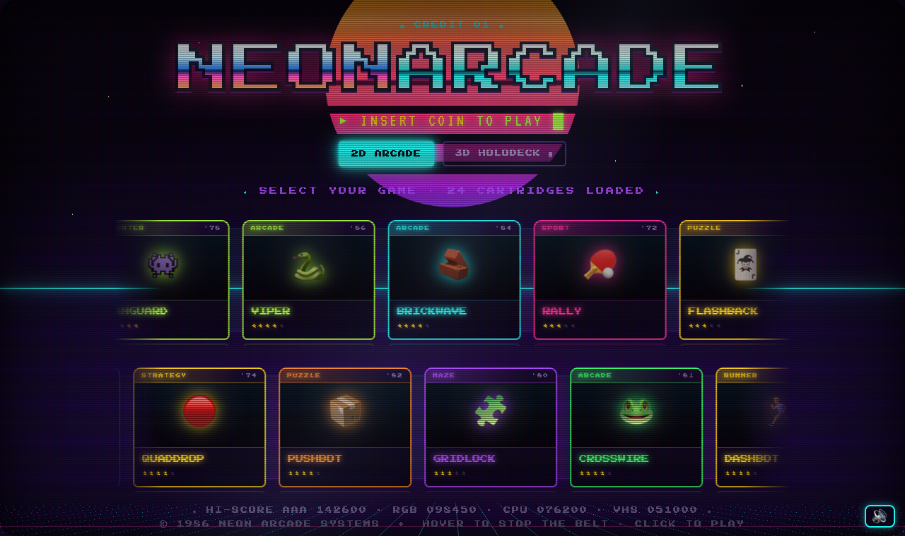
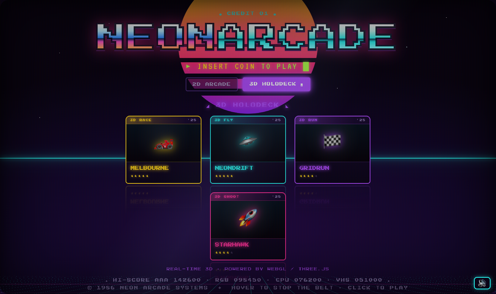
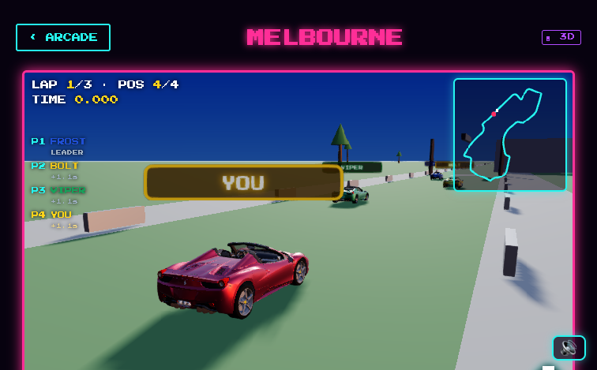
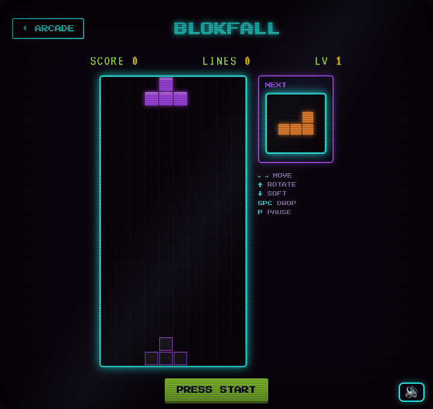
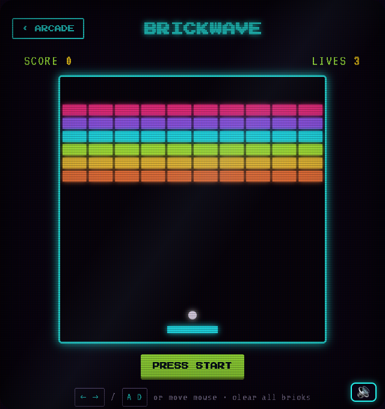
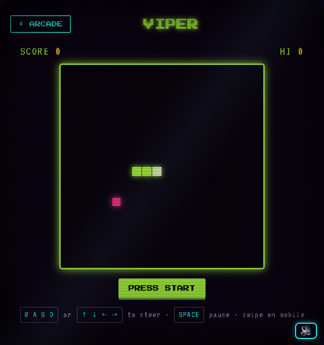
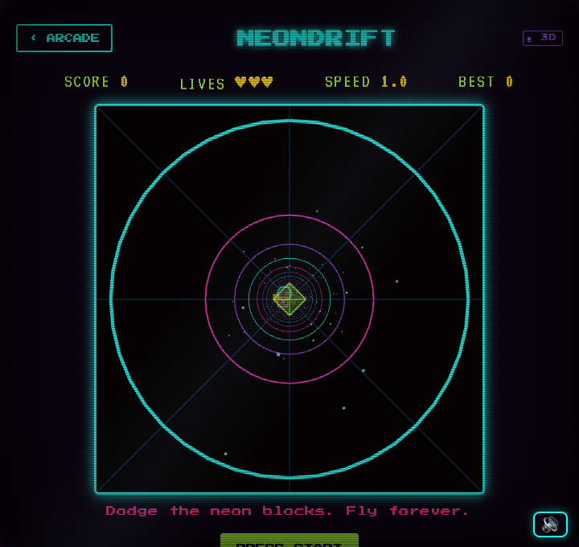
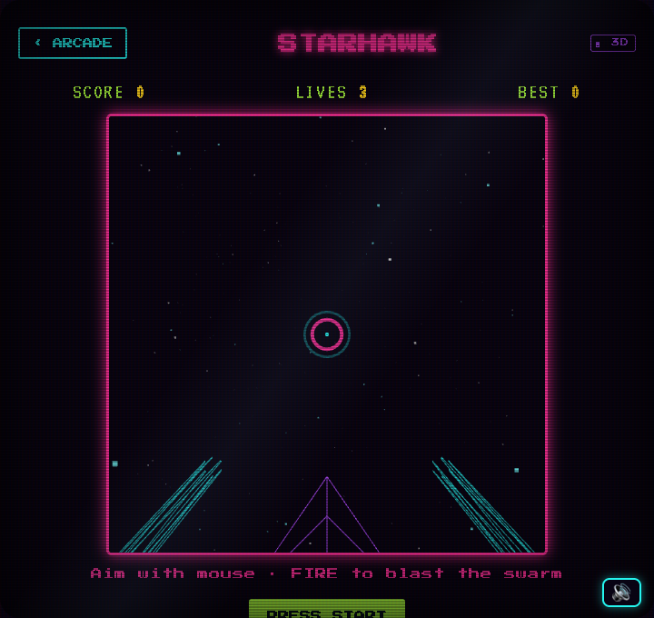
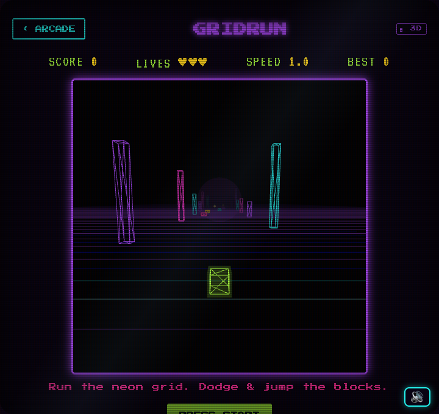

# 🕹️ NEON ARCADE

A retro **80s-arcade game hub** — 24 hand-built 2D mini-games plus a **3D HOLODECK** of WebGL games, all in one place. CRT scanlines, an Outrun sunset, a neon conveyor belt of cartridges, synthesized chiptune sound, and a full 3D racing game on the real Melbourne circuit.

Pure vanilla JavaScript + HTML/CSS, with [Three.js](https://threejs.org) for the 3D games. No build step, no framework, no runtime dependencies.



---

## ✨ Highlights

- **24 original 2D games** — every one self-contained vanilla JS, sharing one neon stylesheet and a Web-Audio sound library.
- **4 real-time 3D games** (Three.js) in the **3D HOLODECK** tab.
- **MELBOURNE** — a 3D racer on the **real Albert Park circuit** with a GLTF Ferrari, HDRI lighting, configurable AI rivals, live standings, DRS zones, and a race-setup menu.
- **Authentic CRT/Outrun look** — scan-lined sun, perspective grid, chrome lettering, screen-door scanlines, power-on sweep.
- **Sound** — a tiny synthesized SFX engine (no audio files) + an ambient synth hum on the hub, with a global mute toggle.

| 3D Holodeck | Melbourne GP |
|---|---|
|  |  |

---

## ▶️ Run it

It's a static site — serve the folder with anything:

**[Laravel Herd](https://herd.laravel.com)** (macOS): the project lives under `~/Herd/`, so it's served automatically at **http://mini-games-.test** (note: lowercase host).

**Any static server:**
```bash
# from the project folder
python3 -m http.server 8000
# then open http://localhost:8000
```

> The 3D games need WebGL. The MELBOURNE racer streams a ~1.6 MB car model and a ~1.3 MB HDRI on first load (both vendored in `assets/`), so give it a couple of seconds.

---

## 🎮 2D Games

Tab **2D ARCADE** on the hub. Keyboard + touch, high scores saved locally.

| Game | Type | | Game | Type |
|------|------|---|------|------|
| **VIPER** | Snake | | **VECTOR** | Asteroids |
| **BRICKWAVE** | Breakout | | **VANGUARD** | Space shooter |
| **RALLY** | Pong (vs CPU) | | **BOOMGRID** | Minesweeper |
| **FLASHBACK** | Memory match | | **QUADDROP** | Connect Four (vs CPU) |
| **TRIGRID** | Tic-Tac-Toe (unbeatable CPU) | | **PUSHBOT** | Sokoban (box pusher) |
| **FUSION** | 2048 | | **GRIDLOCK** | Generated maze |
| **ECHO** | Simon (with tones) | | **CROSSWIRE** | Frogger-style crossing |
| **BONK** | Whack-a-Mole | | **DASHBOT** | Endless runner |
| **BLOKFALL** | Falling blocks | | **BLACKOUT** | Lights Out |
| **JETBIRD** | Flappy-style flyer | | **TILESHIFT** | 15-puzzle |
| **WORDLOCK** | Hangman | | **TRIAD** | Rock-Paper-Scissors |
| **QUICKDRAW** | Reaction test | | **CHROMA** | Stroop colour match |

| Tetris-style | Breakout | Snake |
|---|---|---|
|  |  |  |

---

## 🧊 3D Games (HOLODECK)

Tab **3D HOLODECK** — built on Three.js.

| Game | What it is |
|------|------------|
| **GRAND PRIX** | 3D racer on **5 real circuits** (Melbourne, Monza, Silverstone, Suzuka, Spa — real survey data, accurate lengths & racing direction). GLTF Ferrari + **downloaded PBR road/grass textures**, HDRI sky + reflections, soft shadows, bloom; **pit lanes**, continuous Armco barriers, grandstands at real positions; **1–7 named AI rivals**, selectable **track / laps / difficulty / FOV / camera**, a 3-2-1 start, live **standings with gap/interval timing**, colour-coded name tags, **DRS zones** (for you *and* the AI), an **FPS counter**, an **RPM + gear gauge**, and a finish screen. |
| **NEONDRIFT** | First-person neon tunnel flyer — dodge blocks and fly through ring gates. |
| **GRIDRUN** | Synthwave ground runner — strafe and jump over obstacles, grab orbs. |
| **STARHAWK** | First-person space shooter — wave-based, multiple enemy types. |

| NEONDRIFT | STARHAWK | GRIDRUN |
|---|---|---|
|  |  |  |

---

## 🛠️ Tech & structure

```
index.html          hub (2D belt + 3D holodeck tabs)
style.css           shared CRT/Outrun theme
sfx.js              Web-Audio SFX library + mute toggle + ambient hum
*.html              one file per 2D game
neondrift / gridrun / starhawk / australia .html   3D games (australia = GRAND PRIX racer)
tracks.js           5 real circuit centrelines (Melbourne, Monza, Silverstone, Suzuka, Spa)
lib/                vendored Three.js r128 addons (loaders, post-processing, sky)
assets/             ferrari.glb, venice_sunset_1k.hdr
three.min.js        vendored Three.js r128
screenshots/        images used in this README
```

Everything is vendored so it runs offline.

## 🙏 Credits

- 3D engine, GLTF **Ferrari** model, and **venice_sunset** HDRI — [Three.js](https://github.com/mrdoob/three.js) (MIT) and its examples.
- Albert Park circuit centreline — [TUMFTM/racetrack-database](https://github.com/TUMFTM/racetrack-database).
- Fonts — *Press Start 2P* and *VT323* (Google Fonts, OFL).
- Sound — synthesized at runtime via the Web Audio API (no samples).

---

*Built as a playground project. Insert coin. 👾*
